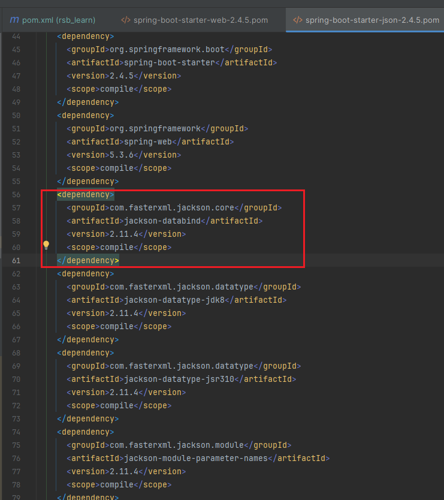
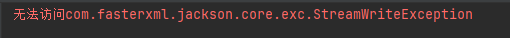
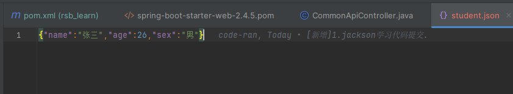
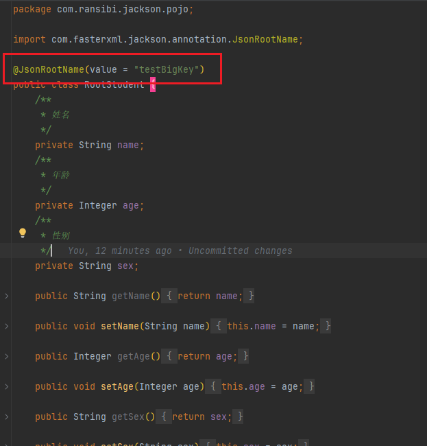
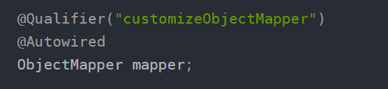

### 1、Jackson官网

```
https://github.com/FasterXML/jackson
```

### 2、概述

```
(1)Jackson是由FasterXML开发的一个高性能的JSON解析库，广泛用于Java应用程序中。
(2)它提供了轻量级、快速、灵活的API，支持JSON和Java对象之间的双向转换。
(3)Jackson的性能较高，可以处理大型JSON数据流。
(4)Jackson可以与Spring框架集成得很好，并且在企业级应用中得到广泛应用。
```

```
Jackson 有三个核心包，分别是 Streaming、Annotations、Databind，通过这些包可以方便的对 JSON 进行操作。
(1)Streaming 在 jackson-core 模块。定义了一些低级别流处理相关的API以及特定的JSON实现。
(2)Annotations 在 jackson-annotations 模块，包含了Jackson中的注解。
(3)Databind 在 jackson-databind 模块， 在Streaming包的基础上实现了数据绑定，依赖于Streaming和Annotations包。
```

### 3、依赖

jackson-databind依赖了jackson-core和 jackson-annotations，所以只需要引入jackson-databind即可

```xml
<!-- https://mvnrepository.com/artifact/com.fasterxml.jackson.core/jackson-databind -->
<dependency>
    <groupId>com.fasterxml.jackson.core</groupId>
    <artifactId>jackson-databind</artifactId>
    <version>2.17.1</version>
</dependency>
```

如果你是springboot项目，并且有引入spring-boot-starter-web这个starter，你就不需要引入上方jackson的依赖包了，因为引入web这个starter自带就带有jackson依赖包



springboot升级指定版本的jackson。

首先排除下springboot自带的jackson

```
        <dependency>
            <groupId>org.springframework.boot</groupId>
            <artifactId>spring-boot-starter-web</artifactId>
            <exclusions>
                <exclusion>
                    <groupId>org.springframework.boot</groupId>
                    <artifactId>spring-boot-starter-json</artifactId>
                </exclusion>
            </exclusions>
        </dependency>
```

然后引入指定版本的jackson

```
        <!-- JSON工具类 -->
        <dependency>
            <groupId>com.fasterxml.jackson.core</groupId>
            <artifactId>jackson-databind</artifactId>
            <version>${jackson.version.databind}</version>
        </dependency>
```

```
    <properties>
        <jackson.version.databind>2.12.3</jackson.version.databind>
    </properties>
```

注意，如果引用的jackson依赖过高，会出现与springboot不兼容的情况，此时需要升级springboot版本。



### 4、常用API使用

JsonFactory是线程安全的，可以放心的作为全局变量给多线程同时使用


#### 单个对象序列化

```java
package com.ransibi.jackson.pojo;

public class Student {
    /**
     * 姓名
     */
    private String name;
    /**
     * 年龄
     */
    private Integer age;
    /**
     * 性别
     */
    private String sex;

    public String getName() {
        return name;
    }

    public void setName(String name) {
        this.name = name;
    }

    public Integer getAge() {
        return age;
    }

    public void setAge(Integer age) {
        this.age = age;
    }

    public String getSex() {
        return sex;
    }

    public void setSex(String sex) {
        this.sex = sex;
    }
}
```

##### 1、对象转字符串

```java
        Student student = new Student();
        student.setName("张三");
        student.setAge(26);
        student.setSex("男");
        ObjectMapper objectMapper = new ObjectMapper();
        String str = null;
        try {
            //java对象转字符串
            str = objectMapper.writeValueAsString(student);
            System.out.println("str"+str);
        } catch (JsonProcessingException e) {
            throw new RuntimeException(e);
        }
```

```
str{"name":"张三","age":26,"sex":"男"}
```

##### 2、对象转文件

```
        Student student = new Student();
        student.setName("张三");
        student.setAge(26);
        student.setSex("男");
        ObjectMapper objectMapper = new ObjectMapper();
        try {
            //对象转文件
            objectMapper.writeValue(new File("student.json"),student);
        } catch (IOException e) {
            throw new RuntimeException(e);
        }
```



##### 3、对象转数组

```java
        Student student = new Student();
        student.setName("张三");
        student.setAge(26);
        student.setSex("男");
        ObjectMapper objectMapper = new ObjectMapper();
        try {
            //对象转数组
            byte[] studentBytes = objectMapper.writeValueAsBytes(student);
            System.out.println("studentBytes:"+studentBytes);
        } catch (JsonProcessingException e) {
            throw new RuntimeException(e);
        }
```

```
studentBytes:[B@50bb75f6
```

#### 单个对象反序列化

##### 1、字符串转对象

```java
        try {
            //字符串转对象
            ObjectMapper objectMapper = new ObjectMapper();
            String testStr = "{\"name\":\"张三\",\"age\":26,\"sex\":\"男\"}";
            Student student1 = objectMapper.readValue(testStr, Student.class);
            System.out.println("student1"+student1);
        } catch (JsonProcessingException e) {
            throw new RuntimeException(e);
        }
```

```
student1com.ransibi.jackson.pojo.Student@2fc098a8
```

##### 2、文件转对象

```java
        try {
            //文件转对象
            ObjectMapper objectMapper = new ObjectMapper();
            Student student1 = objectMapper.readValue(new File("student.json"), Student.class);
            System.out.println("student1"+student1);
        } catch (IOException e) {
            throw new RuntimeException(e);
        }
```

```
student1com.ransibi.jackson.pojo.Student@190a790c
```

##### 3、byte数组转对象

```java
        //byte数组转对象
        try {
            ObjectMapper objectMapper = new ObjectMapper();
            byte[] bytes = objectMapper.writeValueAsBytes(student);
            Student student1 = objectMapper.readValue(bytes, Student.class);
            System.out.println("student1"+student1);
        } catch (IOException e) {
            throw new RuntimeException(e);
        }
```

```
student1com.ransibi.jackson.pojo.Student@76f32d77
```

##### 4、网络地址转对象

```java
        try {
            //字符串网络地址转对象
            String testJsonDataUrl = "http://xxxxxxxx/student.json";
            Student student3 = objectMapper.readValue(testJsonDataUrl, Student.class);
            System.out.println("student3"+student3);
        } catch (JsonProcessingException e) {
            throw new RuntimeException(e);
        }
```

#### 集合序列化

```java
        //集合序列化
        Map<String, Object> map = new HashMap<>();
        map.put("name", "张三");
        map.put("age", 25);
        map.put("sex", "男");
        try {
            String mapStr = objectMapper.writeValueAsString(map);
            System.out.println("mapStr:" + mapStr);
        } catch (JsonProcessingException e) {
            throw new RuntimeException(e);
        }
```


#### 集合反序列化

```java
        //集合反序列化
        try {
            String mapString = "{\"sex\":\"男\",\"name\":\"张三\",\"age\":25}";
            Map<String, Object> map1 = objectMapper.readValue(mapString, new TypeReference<Map<String, Object>>() {
            });
            System.out.println("map1:" + map1);
        } catch (JsonProcessingException e) {
            throw new RuntimeException(e);
        }
```


```java
        //使用JsonNode做反序列化
        try {
            String mapJsonStr = "{\"sex\":\"男\",\"name\":\"张三\",\"age\":25}";
            JsonNode jsonNode = objectMapper.readTree(mapJsonStr);
            String name = jsonNode.get("name").asText();
            int age = jsonNode.get("age").asInt();
            String sex = jsonNode.get("sex").asText();
            System.out.println("name:" + name);
            System.out.println("age:" + age);
            System.out.println("sex:" + sex);
        } catch (JsonProcessingException e) {
            throw new RuntimeException(e);
        }
```


#### 时间字段格式化

```java
        //时间字段格式化
        Map<String, Object> dateMap = null;
        String dateMapStr = null;
        dateMap = new HashMap<>();
        dateMap.put("today", new Date());
        try {
            dateMapStr = objectMapper.writeValueAsString(dateMap);
            System.out.println("默认的时间序列化:"+dateMapStr);
        } catch (JsonProcessingException e) {
            throw new RuntimeException(e);
        }

        // 设置时间格式
        try {
            objectMapper.setDateFormat(new SimpleDateFormat("yyyy-MM-dd hh:mm:ss"));
            dateMapStr = objectMapper.writeValueAsString(dateMap);
            System.out.println("自定义时间序列化:"+dateMapStr);
        } catch (JsonProcessingException e) {
            throw new RuntimeException(e);
        }
```


#### json数组反序列化

```java
        //json数组的反序列化
        String jsonArrayStr  = "[{\"name\":\"张三\",\"age\":26,\"sex\":\"男\"},{\"name\":\"李四\",\"age\":25,\"sex\":\"女\"}]";
        try {
            Student[] students = objectMapper.readValue(jsonArrayStr, Student[].class);
            System.out.println("students:"+students);
        } catch (JsonProcessingException e) {
            throw new RuntimeException(e);
        }
```


#### json数组序列化为List 对象

```java
        try {
            String jsonArrayStr  = "[{\"name\":\"张三\",\"age\":26,\"sex\":\"男\"},{\"name\":\"李四\",\"age\":25,\"sex\":\"女\"}]";
            //json数组转对象集合
            List<Student> twitterEntryList = objectMapper.readValue(jsonArrayStr, new TypeReference<List<Student>>() {});
            System.out.println("json数组反序列化成对象集合:"+twitterEntryList);
        } catch (JsonProcessingException e) {
            throw new RuntimeException(e);
        }
```


#### 常用配置

序列化结果格式化：

```
mapper.enable(SerializationFeature.INDENT_OUTPUT);
```


空对象不要抛出异常：

```
mapper.disable(SerializationFeature.FAIL_ON_EMPTY_BEANS);
```


Date、Calendar等序列化为时间格式的字符串(如果不执行以下设置，就会序列化成时间戳格式)：

```
mapper.disable(SerializationFeature.WRITE_DATES_AS_TIMESTAMPS);
```


反序列化时，遇到未知属性不要抛出异常：

```
mapper.disable(DeserializationFeature.FAIL_ON_UNKNOWN_PROPERTIES);
```


反序列化时，空字符串对于的实例属性为null：

```
mapper.enable(DeserializationFeature.ACCEPT_EMPTY_STRING_AS_NULL_OBJECT);
```


允许C和C++样式注释：

```
mapper.configure(JsonParser.Feature.ALLOW_COMMENTS, true);
```


允许字段名没有引号（可以进一步减小json体积）：

```
mapper.configure(JsonParser.Feature.ALLOW_UNQUOTED_FIELD_NAMES, true);
```


允许单引号：

```
mapper.configure(JsonParser.Feature.ALLOW_SINGLE_QUOTES, true);
```


#### WRAP_ROOT_VALUE特性

新建一个RootStudent实体类，并使用@JsonRootName注解可以在序列化时在最外层增加一个key



```java
            RootStudent rootStudent = new RootStudent();
            rootStudent.setName("张三");
            rootStudent.setAge(26);
            rootStudent.setSex("男");
            //开启在序列化时增加root对象
            objectMapper.enable(SerializationFeature.WRAP_ROOT_VALUE);
            objectMapper.enable(SerializationFeature.INDENT_OUTPUT);
            String s = objectMapper.writeValueAsString(rootStudent);
            System.out.println("s:"+s);
```

输出

```json
s:{
  "testBigKey" : {
    "name" : "张三",
    "age" : 26,
    "sex" : "男"
  }
}
```


```
            //含有最外层key的反序列化,开启配置
            objectMapper.enable(DeserializationFeature.UNWRAP_ROOT_VALUE);
            RootStudent rootStudent1 = objectMapper.readValue(s, RootStudent.class);
            System.out.println("rootStudent1:"+rootStudent1);
```


### JsonInclude注解

取值情况

```java
ALWAYS // 默认策略，任何情况都执行序列化
NON_NULL // 非空
NON_ABSENT // null的不会序列化，但如果类型是AtomicReference，依然会被序列化
NON_EMPTY // null、集合数组等没有内容、空字符串等，都不会被序列化
NON_DEFAULT // 如果字段是默认值，就不会被序列化
CUSTOM // 此时要指定valueFilter属性，该属性对应一个类，用来自定义判断被JsonInclude修饰的字段是否序列化
USE_DEFAULTS // 当JsonInclude在类和属性上都有时，优先使用属性上的注解，此时如果在序列化的get方法上使用了JsonInclude，并设置为USE_DEFAULTS，就会使用类注解的设置  
```

#### 1、ALWAYS

表示全部序列化，null和空字符串都会被序列化

```java
package com.ransibi.jackson.controller.jsoninclude;


import com.fasterxml.jackson.annotation.JsonInclude;
import com.fasterxml.jackson.databind.ObjectMapper;
import com.fasterxml.jackson.databind.SerializationFeature;
import com.fasterxml.jackson.datatype.jdk8.Jdk8Module;

public class Always {

    @JsonInclude(JsonInclude.Include.ALWAYS)
    static class Test {
        private String field0;
        private String field1;

        public String getField0() {
            return field0;
        }
        public void setField0(String field0) {
            this.field0 = field0;
        }
        public String getField1() {
            return field1;
        }
        public void setField1(String field1) {
            this.field1 = field1;
        }
    }

    public static void main(String[] args) throws Exception {
        ObjectMapper mapper = new ObjectMapper();
        // 美化输出
        mapper.enable(SerializationFeature.INDENT_OUTPUT);
        // jackson支持Optional特性
        mapper.registerModule(new Jdk8Module());
        Test test = new Test();
        test.setField0(null);
        test.setField1("");
        System.out.println(mapper.writeValueAsString(test));
    }
}
```

#### 2、NON_NULL

值为null就不序列化

```java
package com.ransibi.jackson.controller.jsoninclude;

import com.fasterxml.jackson.annotation.JsonInclude;
import com.fasterxml.jackson.databind.ObjectMapper;
import com.fasterxml.jackson.databind.SerializationFeature;
import com.fasterxml.jackson.datatype.jdk8.Jdk8Module;

public class NonNull {

    @JsonInclude(JsonInclude.Include.NON_NULL)
    static class Test {
        private String field0;
        private String field1;

        public String getField0() { return field0; }
        public void setField0(String field0) { this.field0 = field0; }
        public String getField1() { return field1; }
        public void setField1(String field1) { this.field1 = field1; }
    }

    public static void main(String[] args) throws Exception {
        ObjectMapper mapper = new ObjectMapper();
        // 美化输出
        mapper.enable(SerializationFeature.INDENT_OUTPUT);
        // jackson支持Optional特性
        mapper.registerModule(new Jdk8Module());

        Test test = new Test();
        test.setField0(null);
        test.setField1("");

        System.out.println(mapper.writeValueAsString(test));
    }
}
```


#### 3、NON_ABSENT

NON_ABSENT表示当实例化的对象有Optional或AtomicReference类型的成员变量时，如果Optional引用的实例为空，用NON_ABSENT能使该字段不做序列化；

增加依赖

```xml
<dependency>
    <groupId>com.fasterxml.jackson.datatype</groupId>
    <artifactId>jackson-datatype-jdk8</artifactId>
    <version>2.11.0</version>
</dependency>
```

```
mapper.registerModule(new Jdk8Module());
```


```java
package com.ransibi.jackson.controller.jsoninclude;


import com.fasterxml.jackson.annotation.JsonInclude;
import com.fasterxml.jackson.databind.ObjectMapper;
import com.fasterxml.jackson.databind.SerializationFeature;
import com.fasterxml.jackson.datatype.jdk8.Jdk8Module;

import java.util.Optional;
import java.util.concurrent.atomic.AtomicReference;

public class NonAbsent {

    @JsonInclude(JsonInclude.Include.NON_ABSENT)
    static class Test {
        private String field0;
        private String field1;
        private Optional<String> field2;
        private AtomicReference<String> field3;

        public String getField0() { return field0; }
        public void setField0(String field0) { this.field0 = field0; }
        public String getField1() { return field1; }
        public void setField1(String field1) { this.field1 = field1; }
        public Optional<String> getField2() { return field2; }
        public void setField2(Optional<String> field2) { this.field2 = field2; }
        public AtomicReference<String> getField3() { return field3; }
        public void setField3(AtomicReference<String> field3) { this.field3 = field3; }
    }

    public static void main(String[] args) throws Exception {
        ObjectMapper mapper = new ObjectMapper();
        // 美化输出
        mapper.enable(SerializationFeature.INDENT_OUTPUT);
        // jackson支持Optional特性
        mapper.registerModule(new Jdk8Module());

        Test test = new Test();
        test.setField0(null);
        test.setField1("");
        test.setField2(Optional.empty());
        test.setField3(new AtomicReference<>());

        System.out.println(mapper.writeValueAsString(test));
    }
}
```


#### 4、NON_EMPTY

```
null、空字符串、空集合、空数组、Optional类型的，其引用为空、AtomicReference类型的，其引用为空都不会进行序列化
```


```java
package com.ransibi.jackson.controller.jsoninclude;

import com.fasterxml.jackson.annotation.JsonInclude;
import com.fasterxml.jackson.databind.ObjectMapper;
import com.fasterxml.jackson.databind.SerializationFeature;
import com.fasterxml.jackson.datatype.jdk8.Jdk8Module;

import java.util.ArrayList;
import java.util.List;
import java.util.Optional;
import java.util.concurrent.atomic.AtomicReference;

public class NonEmpty {

    @JsonInclude(JsonInclude.Include.NON_EMPTY)
    static class Test {
        private String field0;
        private String field1;
        private Optional<String> field2;
        private AtomicReference<String> field3;
        private List<String> field4;
        private String[] field5;

        public String getField0() { return field0; }
        public void setField0(String field0) { this.field0 = field0; }
        public String getField1() { return field1; }
        public void setField1(String field1) { this.field1 = field1; }
        public Optional<String> getField2() { return field2; }
        public void setField2(Optional<String> field2) { this.field2 = field2; }
        public AtomicReference<String> getField3() { return field3; }
        public void setField3(AtomicReference<String> field3) { this.field3 = field3; }
        public List<String> getField4() { return field4; }
        public void setField4(List<String> field4) { this.field4 = field4; }
        public String[] getField5() { return field5; }
        public void setField5(String[] field5) { this.field5 = field5; }
    }

    public static void main(String[] args) throws Exception {
        ObjectMapper mapper = new ObjectMapper();
        // 美化输出
        mapper.enable(SerializationFeature.INDENT_OUTPUT);
        // jackson支持Optional特性
        mapper.registerModule(new Jdk8Module());

        Test test = new Test();
        test.setField0(null);
        test.setField1("");
        test.setField2(Optional.empty());
        test.setField3(new AtomicReference<>());
        test.setField4(new ArrayList<>());
        test.setField5(new String[] {});

        System.out.println(mapper.writeValueAsString(test));
    }
}
```


#### 5、NON_DEFAULT

设置为NON_DEFAULT后，对保持默认值的字段不做序列化

```java
package com.ransibi.jackson.controller.jsoninclude;

import com.fasterxml.jackson.annotation.JsonInclude;
import com.fasterxml.jackson.databind.ObjectMapper;
import com.fasterxml.jackson.databind.SerializationFeature;

public class NonDefault {

    @JsonInclude(JsonInclude.Include.NON_DEFAULT)
    static class Test {

        private String field0 = "aaa";
        private String field1 = "aaa";

        public String getField0() { return field0; }
        public void setField0(String field0) { this.field0 = field0; }
        public String getField1() { return field1; }
        public void setField1(String field1) { this.field1 = field1; }
    }

    public static void main(String[] args) throws Exception {
        ObjectMapper mapper = new ObjectMapper();
        // 美化输出
        mapper.enable(SerializationFeature.INDENT_OUTPUT);

        Test test = new Test();
        test.setField1("bbb");

        System.out.println(mapper.writeValueAsString(test));
    }
}
```


#### 6、CUSTOM

JsonInclude的value等于CUSTOM时，在序列化的时候会执行CustomFilter的equals方法，该方法的入参就是field0的值，如果equals方法返回true，field0就不会被序列化，如果equals方法返回false时field0才会被序列化

```java
package com.ransibi.jackson.controller.jsoninclude;

import com.fasterxml.jackson.annotation.JsonInclude;
import com.fasterxml.jackson.databind.ObjectMapper;
import com.fasterxml.jackson.databind.SerializationFeature;

public class Custom {

    static class CustomFilter {
        @Override
        public boolean equals(Object obj) {
            // null，或者不是字符串就返回true，意味着不被序列化
            if (null == obj || !(obj instanceof String)) {
                return true;
            }

            // 长度大于2就返回true，意味着不被序列化
            return ((String) obj).length() > 2;
        }
    }

    static class Test {

        @JsonInclude(value = JsonInclude.Include.CUSTOM, valueFilter = CustomFilter.class)
        private String field0;

        @JsonInclude(value = JsonInclude.Include.CUSTOM, valueFilter = CustomFilter.class)
        private String field1;

        @JsonInclude(value = JsonInclude.Include.CUSTOM, valueFilter = CustomFilter.class)
        private String field2;

        public String getField0() {
            return field0;
        }

        public void setField0(String field0) {
            this.field0 = field0;
        }

        public String getField1() {
            return field1;
        }

        public void setField1(String field1) {
            this.field1 = field1;
        }

        public String getField2() {
            return field2;
        }

        public void setField2(String field2) {
            this.field2 = field2;
        }
    }

    public static void main(String[] args) throws Exception {
        ObjectMapper mapper = new ObjectMapper();
        // 美化输出
        mapper.enable(SerializationFeature.INDENT_OUTPUT);

        Test test = new Test();
        test.setField0(null);
        test.setField1("1");
        test.setField2("123");

        System.out.println(mapper.writeValueAsString(test));
    }
}
```


#### 7、USE_DEFAULTS

```
类注解和成员变量注解同时存在时，以成员变量注解为准；如果对应的get方法也使用了JsonInclude注解，并且值是USE_DEFAULTS，此时以类注解为准；
```


```java
package com.ransibi.jackson.controller.jsoninclude;

import com.fasterxml.jackson.annotation.JsonInclude;
import com.fasterxml.jackson.databind.ObjectMapper;

import java.util.ArrayList;
import java.util.List;

public class UseDefaults {

    @JsonInclude(JsonInclude.Include.NON_EMPTY)
    static class Test {

        @JsonInclude(JsonInclude.Include.NON_NULL)
        private List<String> field0;

        @JsonInclude(JsonInclude.Include.USE_DEFAULTS)
        public List<String> getField0() {
            return field0;
        }

        public void setField0(List<String> field0) {
            this.field0 = field0;
        }
    }

    public static void main(String[] args) throws Exception {
        ObjectMapper mapper = new ObjectMapper();

        Test test = new Test();

        test.setField0(new ArrayList<>());

        System.out.println(mapper.writeValueAsString(test));
    }
}
```


### 常用类注解

#### 1、@JsonRootName

#### 2、 @JsonIgnoreProperties

用于指定序列化和反序列化时要忽略的字段

```java
    @JsonIgnoreProperties({"field1", "field2"})
    static class Test {
        private String field0;
        private String field1;
        private String field2;
        //get、set、toString方法
        }
```

只有field0参与序列化与反序列化

#### 3、@JsonIgnoreType

被该注解修饰的类，作为其他类的成员变量时，不论是序列化还是反序列化都被忽略了

#### 4、@JsonAutoDetect

序列化和反序列化时自动识别的范围

#### 5、@JsonPropertyOrder

```java
@JsonAutoDetect(fieldVisibility = JsonAutoDetect.Visibility.PUBLIC_ONLY)
public class College {
    private String name;
    private String sex;
    protected int age = 100;
```

fieldVisibility属性

```java
ANY // 所有
NON_PRIVATE // private之外的
PROTECTED_AND_PUBLIC // protected和public的(此时privte和默认的package access时不能被自动识别的)
PUBLIC_ONLY // public的
NONE // 禁止自动识别
DEFAULT // 默认的，用于继承父类的自动识别的范围

```


#### 6、@JsonInclude

指定序列化的顺序，注意该注解仅在序列化场景有效

```java
    @JsonPropertyOrder({"field2", "field0", "field1"})
    static class Test {
        private String field0;
        private String field1;
        private String field2;
        // 省去get、set、toString方法
        }
```

### 常用Field注解

#### 1、JsonProperty

JsonProperty可以作用在成员变量和方法上，作用是在序列化和反序列化操作中指定json字段的名称,index是序列化的顺序

```java
    static class Test {

        @JsonProperty(value="json_field0", index = 1)
        private String field0;

        @JsonProperty(value="json_field1", index = 0)
        public String getField1() {
            return "111";
        }
    }
```


#### 2、JsonIgnore

作用在成员变量或者方法上，指定被注解的变量或者方法不参与序列化和反序列化操作；

#### 3、JacksonInject

在反序列化的时候，将配置好的值注入被JacksonInject注解的字段;

#### 4、JsonSerialize

被此注解修饰的字段或者get方法会被用于序列化

#### 5、JsonDeserialize

JsonDeserialize用于反序列化场景，被此注解修饰的字段或者set方法会被用于反序列化

#### 6、JsonRawValue

使用该注解的字段或者方法，都会被序列化，但是序列化结果是原始值，例如字符串是不带双引号的：


### 方法注解


### 集成到SpringBoot后的yml配置信息

```java
server:
  port: 8099

spring:
  jackson:
    # 日期格式化
    date-format: yyyy-MM-dd HH:mm:ss
    # 序列化相关
    serialization:
      # 格式化输出
      indent_output: true
      # 忽略无法转换的对象
      fail_on_empty_beans: true
    # 反序列化相关
    deserialization:
      # 解析json时，遇到不存在的属性就忽略
      fail_on_unknown_properties: false
    # 设置空如何序列化
    defaultPropertyInclusion: NON_EMPTY
    parser:
      # 允许特殊和转义符
      allow_unquoted_control_chars: true
      # 允许单引号
      allow_single_quotes: true
```


### 集成到SpringBoot后的配置类

```java
@Configuration
public class JacksonConfig {

    @Bean("customizeObjectMapper")
    @Primary
    @ConditionalOnMissingBean(ObjectMapper.class)
    public ObjectMapper getObjectMapper(Jackson2ObjectMapperBuilder builder) {
        ObjectMapper mapper = builder.build();
        // 日期格式
        mapper.setDateFormat(new SimpleDateFormat("yyyy-MM-dd hh:mm:ss"));
        // 美化输出
        mapper.enable(SerializationFeature.INDENT_OUTPUT);
        return mapper;
    }
}
```

在使用ObjectMapper实例的地方，用Autowired注解的时候，记得带上Qualifier注解



SpringBoot集成jackson后可以通过yml进行配置，也可以通过配置类进行配置
